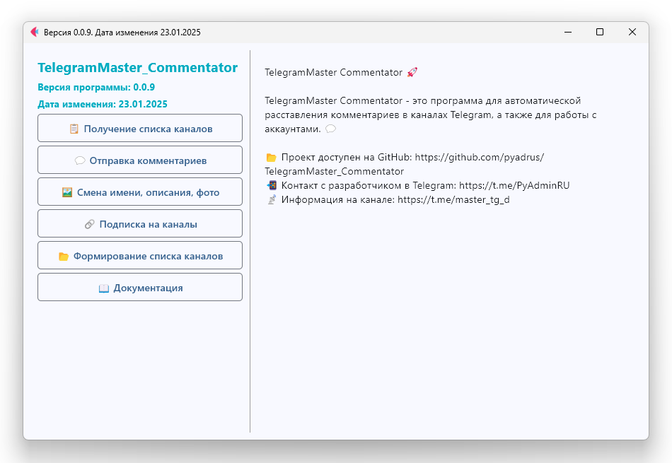

# TelegramMaster Commentator 🚀



**TelegramMaster Commentator** — это мощный инструмент для автоматизации работы с Telegram каналами, группами и
аккаунтами.
Бот позволяет управлять каналами, комментировать публикации, изменять профиль, а также многое другое через удобный
интерфейс на основе Flet.

## Документация
[Документация](doc/doc.md)


## 🌟 Другие мои проекты

Я активно развиваюсь в сфере разработки инструментов для Telegram. Вот другие мои проекты, которые могут вас
заинтересовать:

**TelegramMaster 2.0**

**TelegramMaster 2.0** — это продвинутый инструмент для работы с Telegram.

📨 Программа предлагает множество функций для:

* Управления аккаунтами.
* Взаимодействия с пользователями.
* Автоматизации рутинных процессов.

Переходите по ссылке, чтобы узнать больше:
👉 TelegramMaster 2.0 (https://github.com/pyadrus/TelegramMaster-2.0)

## Возможности

- **Получение списка каналов**: Сканирует аккаунт и формирует список каналов с их данными.
- **Отправка комментариев**: Автоматизирует отправку комментариев в указанные каналы.
- **Управление профилем**: Позволяет изменить имя, описание профиля Telegram-аккаунта.
- **Подписка на каналы**: Упрощает массовую подписку на указанные каналы.
- **Формирование списка каналов**: Создаёт структурированный список каналов в базе данных SQLite.

## Основные особенности

- Удобный графический интерфейс с использованием Tkinter.
- Возможность логирования всех действий с помощью Loguru.
- Использование базы данных SQLite для хранения данных о каналах.
- Лёгкая настройка через файл конфигурации.
- Поддержка маршрутов в интерфейсе, эмулируя современный UX.

## Установка

1. Клонируйте репозиторий:
   ```bash
   git clone https://github.com/pyadrus/TelegramMaster_Commentator.git
   cd TelegramMaster_Commentator
   ```

## Установите зависимости:

```bash
pip install -r requirements.txt
```

## Настройте конфигурацию:

Отредактируйте файл конфигурации config/config.ini для указания данных вашего Telegram API.
Использование
Запустите проект с помощью Python:

```bash
python main.py
```

## В интерфейсе доступны основные функции:

## Кнопки для запуска действий.

Меню для настройки параметров и просмотра информации об авторе.

## Требования

Python 3.8 или выше
Модули из requirements.txt

## Логирование

Все действия программы логируются в файл log/log.log. Логи автоматически архивируются, если их размер превышает 1 МБ.

## Вклад

Если у вас есть идеи или вы хотите внести улучшения, создайте Pull Request или сообщите о проблемах через Issues.

## Лицензия

Этот проект распространяется под лицензией GNU GENERAL PUBLIC LICENSE.

## Контакты

Если у вас возникли вопросы или предложения, свяжитесь с автором проекта:

Telegram: https://t.me/PyAdminRU
